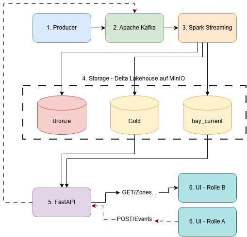

# SmartPark — Streaming-basiertes Smart-Parking-System auf Kubernetes

> **Modul:** Cloud Computing und Big Data · Prüfungsleistung 2026 · Prof. Dr.-Ing. habil. Dennis Pfisterer
> **Gruppe:** `<X>` · **Teammitglieder:** `<Name 1>`, `<Name 2>`, `<Name 3>`, `<Name 4>`
> **Repo:** `<URL>` · **Abgabe:** `<TT.MM.JJJJ>`

<!--
═══════════════════════════════════════════════════════════════════════
  ⚠️  DIESE README IST DAS ALLEINIGE BERICHTSDOKUMENT.
      Ein fehlender Pflichtabschnitt = 0 Punkte im jeweiligen Kriterium.
      Die 12 Überschriften unten NICHT umbenennen oder löschen.
      HTML-Kommentare wie dieser sind Schreibhilfen und werden vor der
      Abgabe entfernt.
═══════════════════════════════════════════════════════════════════════
-->

**Kurzfassung:** SmartPark verarbeitet Belegungsdaten städtischer Parkplatzsensoren
in Echtzeit und stellt Fahrern und Stadtverwaltung die aktuelle Verfügbarkeit je Zone
bereit. Architektur: **Kappa** (streaming-first).
Stack: Kafka → Spark Structured Streaming → Delta Lake auf MinIO → FastAPI → React,
deklarativ deployt per Helm auf einem k3s-Cluster der DHBWCloud.

---

## Inhaltsverzeichnis

1. [Use Case und Motivation](#1-use-case-und-motivation)
2. [Datencharakteristik](#2-datencharakteristik)
3. [Architekturentscheidung: Kappa vs. Lambda](#3-architekturentscheidung-kappa-vs-lambda)
4. [Komponenten und Datenfluss](#4-komponenten-und-datenfluss)
5. [Processing-Logik](#5-processing-logik)
6. [Speicherkonzept](#6-speicherkonzept)
7. [User-facing UI](#7-user-facing-ui)
8. [Kubernetes-Deployment](#8-kubernetes-deployment)
9. [Deployment-Anleitung](#9-deployment-anleitung)
10. [Wesentliche Codeabschnitte](#10-wesentliche-codeabschnitte)
11. [Screenshots und Nachweise](#11-screenshots-und-nachweise)
12. [Grenzen des Prototyps und Ausblick](#12-grenzen-des-prototyps-und-ausblick)

---

## 1. Use Case und Motivation

<!-- 10 P. (zusammen mit §2) · Owner: <Name> · Meilenstein: M6
     Muss enthalten: Problem, Datenquelle, warum das ein Big-Data-Problem ist.
     Argumentationskern: nicht "viele Daten", sondern Velocity + Volume + Variety
     zusammen erzwingen eine Streaming-Lakehouse-Architektur. -->

### 1.1 Problem

`TODO`

### 1.2 Datenquelle

`TODO`

### 1.3 Warum ist das ein Big-Data-Problem?

`TODO`

---

## 2. Datencharakteristik

<!-- Teil der 10 P. aus §1 · Owner: <Name>
     ⚠️ Die V's brauchen KONKRETE ZAHLEN, keine Adjektive.
     Prototyp-Werte UND Zielbild angeben. -->

| V | Ausprägung bei SmartPark | Konkrete Zahlen (Prototyp → Zielbild) |
|---|---|---|
| **Volume** | `TODO` | `TODO` |
| **Velocity** | `TODO` | `TODO` |
| **Variety** | `TODO` | `TODO` |
| *(Veracity)* | `TODO` | `TODO` |

---

## 3. Architekturentscheidung: Kappa vs. Lambda

<!-- 20 P. (zusammen mit §4) · Owner: <Name>
     Pflicht: Entscheidung + Begründung + Warum-nicht-Lambda + Diagramm.
     Das Diagramm MUSS konsistent zu §4 sein — keine verwaisten Boxen. -->

### 3.1 Entscheidung

`TODO`

### 3.2 Begründung

`TODO`

### 3.3 Warum nicht Lambda?

`TODO`

### 3.4 Architekturdiagramm

<!-- Bild nach docs/ legen und hier einbinden: -->
<!--  -->

`TODO`

---

## 4. Komponenten und Datenfluss

<!-- Teil der 20 P. aus §3 · Owner: <Name>
     Jede Technologiewahl BEGRÜNDEN — "haben wir im Kurs gemacht" reicht nicht. -->

### 4.1 Komponenten und Technologiewahl

| Komponente | Technologie | Begründung |
|---|---|---|
| Ingestion | `TODO` | `TODO` |
| Processing | `TODO` | `TODO` |
| Storage | `TODO` | `TODO` |
| Serving-API | `TODO` | `TODO` |
| Query-Layer | `TODO` | `TODO` |
| UI | `TODO` | `TODO` |
| Producer/Simulator | `TODO` | `TODO` |

### 4.2 Ende-zu-Ende-Datenfluss

`TODO`

---

## 5. Processing-Logik

<!-- 20 P. · Owner: AP2
     Hier liegen 20 von 100 Punkten. Mindestens eine nicht-triviale
     Transformation, besser zwei bis drei. Jede muss im Code auffindbar sein
     (§10 verlinken!) und Windowing/State/Late Data adressieren. -->

### 5.1 Transformation 1 — `TODO`

`TODO`

### 5.2 Transformation 2 — `TODO`

`TODO`

### 5.3 Transformation 3 — `TODO`

`TODO`

### 5.4 Windowing, State und Watermarks

`TODO`

### 5.5 Umgang mit Late Data

<!-- ⚠️ Explizit dokumentieren: Watermark-Länge, was passiert mit zu späten
     Events (verwerfen / separate Ablage), State-Timeout beim Session-Join. -->

`TODO`

---

## 6. Speicherkonzept

<!-- 10 P. · Owner: AP3
     Format, Partitionierung, Schema — jeweils BEGRÜNDET.
     Plus: warum Lakehouse und nicht klassische DB / reiner Data Lake. -->

### 6.1 Schichten (Bronze / Gold)

`TODO`

### 6.2 Format und Begründung

`TODO`

### 6.3 Partitionierung und Begründung

`TODO`

### 6.4 Schema

| Tabelle | Feld | Typ | Beschreibung |
|---|---|---|---|
| `TODO` | | | |

### 6.5 Warum Lakehouse?

`TODO`

---

## 7. User-facing UI

<!-- 10 P. · Owner: AP4
     ⚠️ Die UI muss REAL an die Pipeline angebunden sein (kein Mockup) und als
     eigene containerisierte Komponente auf k8s laufen.
     Beide Rollen beschreiben: Datenlieferant UND Anzeige. -->

### 7.1 Rolle A — Datenlieferant (Event-Injektor)

`TODO`

### 7.2 Rolle B — Anzeige (Verfügbarkeit und Trends)

`TODO`

### 7.3 Anbindung an die Pipeline

`TODO`

### 7.4 Bedienablauf

`TODO`

---

## 8. Kubernetes-Deployment

<!-- 15 P. · Owner: AP5
     Workload-Typen begründen (StatefulSet vs. Deployment), Config über
     ConfigMap/Secret, Persistenz über PVC, und Skalierung ZEIGEN (Screenshots
     in §11 verlinken). -->

### 8.1 Abbildung der Komponenten auf Workloads

| Komponente | Workload-Typ | Begründung | Replicas | Requests / Limits |
|---|---|---|---|---|
| Kafka | `TODO` | | | |
| MinIO | `TODO` | | | |
| Spark | `TODO` | | | |
| Serving-API | `TODO` | | | |
| Producer | `TODO` | | | |
| UI | `TODO` | | | |

### 8.2 Konfiguration (ConfigMaps und Secrets)

`TODO`

### 8.3 Persistenz (PVCs)

`TODO`

### 8.4 Skalierbarkeit

<!-- ⚠️ Rubric-Kernpunkt: "muss darauf ausgelegt sein, in allen Komponenten
     horizontal zu skalieren und dies soll gezeigt werden."
     Nachweis = Screenshots vor/nach Last in §11. -->

`TODO`

---

## 9. Deployment-Anleitung

<!-- 10 P. · Owner: AP5
     DHBWCloud-spezifisch! Voraussetzungen nennen: VPN, VM-Flavor, Netzwerk
     DHBWV6, k3s-Setup, kubeconfig, IPv6-Zugriff.
     Test: Ein anderes Teammitglied muss den Stack allein hochbekommen. -->

### 9.1 Voraussetzungen

`TODO`

### 9.2 Versionen

| Werkzeug | Version |
|---|---|
| `TODO` | |

### 9.3 Schritt für Schritt

`TODO`

### 9.4 Zugriff auf UI und API (IPv6 / Ingress)

`TODO`

---

## 10. Wesentliche Codeabschnitte

<!-- Teil der 10 P. "Reproduzierbarkeit und Struktur"
     ⚠️ RELATIVE Pfade verwenden — die Links müssen in der entpackten ZIP
     funktionieren, nicht nur auf GitHub. Je Eintrag ein Satz. -->

| Was | Datei | Was dort passiert |
|---|---|---|
| Ingestion | [`producer/simulator.py`](producer/simulator.py) | `TODO` |
| Processing | [`processing/streaming_job.py`](processing/streaming_job.py) | `TODO` |
| Storage-Sink | `TODO` | `TODO` |
| Serving-API | [`serving/api.py`](serving/api.py) | `TODO` |
| UI | `TODO` | `TODO` |
| Helm-Chart | [`deploy/helm/`](deploy/helm/) | `TODO` |
| Provisioning | [`ansible/deploy.yaml`](ansible/deploy.yaml) | `TODO` |

---

## 11. Screenshots und Nachweise

<!-- Ersetzt den Funktionstest — die Anwendung wird bei der Bewertung NICHT
     ausgeführt. Alle Bilder nach docs/screenshots/ und hier einbinden.
     Laufend sammeln, nicht in Woche 7 rekonstruieren! -->

| Nachweis | Status |
|---|---|
| UI im Betrieb (Dashboard + Event-Injektor) | ⬜ |
| Event über die UI einspeisen | ⬜ |
| `kubectl get pods -n smartpark` | ⬜ |
| `kubectl get svc,ingress -n smartpark` | ⬜ |
| `kubectl get hpa` / ScaledObjects | ⬜ |
| Pods **vor** und **nach** Skalierung | ⬜ |
| Serving-Output (`curl` API-Response) | ⬜ |
| Pipeline-Output (Gold-Tabelle / Delta-Query) | ⬜ |
| Kafka-Topic mit Events | ⬜ |

<!-- Einbinden mit:   -->

`TODO`

---

## 12. Grenzen des Prototyps und Ausblick

<!-- 5 P. "Reflexion und Eigenanteil" · Owner: Koordination
     Ehrlichkeit zahlt sich hier aus. Die DHBWCloud-Ressourcengrenzen
     offen benennen, z. B. "Spark auf 1 Executor mit 512 MB begrenzt, weil
     der VM-Flavor nur X GB RAM hat; in Produktion würde man ...".
     Plus: Aufgabenverteilung und Eigenanteil (siehe docs/TEAM.md). -->

### 12.1 Scope-Grenzen

`TODO`

### 12.2 Ausblick

`TODO`

### 12.3 Aufgabenverteilung und Eigenanteil

<!-- Aus docs/TEAM.md übernehmen, sobald ausgefüllt. -->

`TODO`

---

## Bonus: Abweichungen vom Standardweg

<!-- Kein Pflichtabschnitt, aber: Bonus gibt es NUR mit Begründung.
     Kandidaten: MinIO/Delta statt HDFS, Exactly-once, Schema-Evolution,
     KEDA auf Consumer-Lag, CI/CD. -->

| Abweichung | Umsetzung | Begründung |
|---|---|---|
| `TODO` | | |

---

## Weiterführende Projektdokumente

- [`CONTRIBUTING.md`](CONTRIBUTING.md) — Branch-Strategie und Commit-Konventionen
- [`docs/TEAM.md`](docs/TEAM.md) — Arbeitspakete, Rollen, Eigenanteil-Log
- [`docs/MEILENSTEINE.md`](docs/MEILENSTEINE.md) — Abgabetermin und Meilensteinplan
